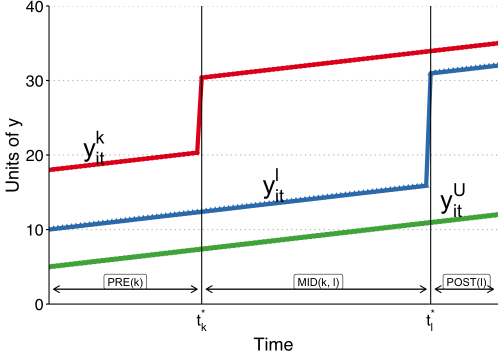
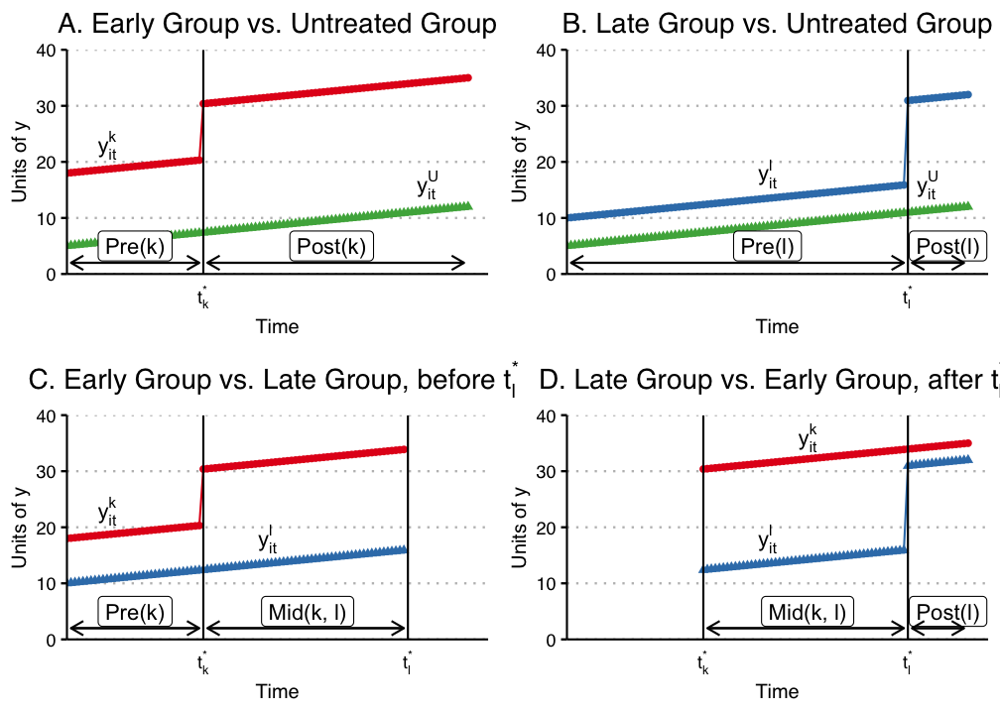

# Difference-in-Differences

```{r}
#| include: false
library(tidyverse)
library(did)
library(broom)
library(skimr)
library(bslib)
library(etwfe)
library(haven)
library(synthdid)
library(fixest)
library(ggplot2)
```

What if unconfoundedness fails? We have to settle for weaker assumptions. One such assumption is the parallel trends assumption. If we have this assumption, we can use a difference-in-differences estimator.

## $T=2$ Panel Data

Suppose we have two periods, $t = (1,2)$. Some units are treated just prior to period 2. For each individual $i$, there are four potential outcomes:

$$ [Y_{i1}(0), Y_{i1}(1), Y_{i2}(0), Y_{i2}(1)] $$

We use $D$ to identify the treated group.

The ATT when $T=2$:

$$ \tau_{2,att} = E(Y_2(1) - Y_2(0) | D=1) $$

In words, we are interested in the ATT in the second period. The difficult part is the second term.

## Parallel Trends Assumption

$$ E[Y_2(0) -Y_1(0) | D=1] = E[Y_2(0) - Y_1(0) | D =0] $$

or

$$ E[\Delta Y(0) | D=1] = E[\Delta Y(0) | D =0] $$

In other words, this means the change of potential outcome for untreated state between period 1 and 2 is independent of treatment assignment (unconfounded).

## No Anticipation Assumption

$$ E[Y_1(1) - Y_1(0) | D=1] = 0 $$

This is to say, in period 1, there is no treatment effect for the treated group.

## DiD is Identified with PT and NA

With Parallel Trends, we notice $$\small  E[Y_2(0) | D=1 ]= E[Y_1(0) | D=1] + E[Y_2(0) - Y_1(0) | D=0] $$

Then, with No Anticipation, $$\small  \begin{align}
E[Y_2(0) | D=1 ] &= E[Y_1(1) | D=1] + E[Y_2(0) - Y_1(0) | D=0]\\
&= E[Y_1 | D=1] + E[Y_2-Y_1 | D=0]
\end{align} $$

$$\small  \tau_{2,att} = E[Y_2 - Y_1 | D=1] - E[Y_2-Y_1 | D=0] $$

## Advantages and Disadvantages of DiD

Advantages:

-   No need to assume unconfoundedness. We "only" need PT and NA. Or say we don't need treatment itself to be independent of potential outcomes, but we do need it to be independent to the change in potential outcome at least for untreated state. This is importantly weaker in a lot of situations. There can be selection bias. If the selection bias does not change over time, then DiD can handle it.

Disadvantages:

-   PT and NA might be violated.
-   PT is not scale free, in the sense that even if outcome can have PT, but then non-linear transformation of outcome won't have PT (for example log of Y).

## Traditional DiD

In practice, DiD in many period setting is usually done with

$$ Y_{it} = \alpha_i + \phi_t + W_{it} \beta + \epsilon_{it} $$

here $W_{it} =(1[t=2] \cdot D_i)$, which is the interaction of post-treatment indicator and treatment group indicator.

This is usually called Two Way Fixed Effect (TWFE). There are multiple ways to implement the same model in practice.

TWFE can be done by "Pooled OLS". That is, using OLS on time dummies and firm (individual) dummies. Wooldridge (2021) shows it's equivalent to use treatment dummies, instead of individual dummies. He also shows that this model can be equivalently implemented with fixed effect model and random effect model.

## TWFE with Staggered Treatment Timing

The problem comes in when there is different timing of treatment. People used to still use

$$ Y_{it} = \alpha_i + \phi_t + W_{it} \beta + \epsilon_{it} $$

where $W_{it}$ now is a dummy when an individual $i$ gets treated at time $t$.

However, what is $\beta$ here?

## Goodman-Bacon Decomposition

Goodman-Bacon (2021) showed that $\beta$ in the TWFE is a weighted average of many different treatment effects, between treated cohorts, and control units, both can be different at different time points. The weights are a function of the size of the subsample, relative size of treatment and control units, and the timing of treatment in the sub sample. They can be negative. The units treated earlier can still be used as controls later. Therefore there is no meaningful interpretation of $\beta$. It does not need to be a convex combination of treatment effects.





## Wooldridge's ETWFE

There are a lot of ways to deal with staggered DiD situation. Wooldridge (2021) is basically saying: This is not a problem of TWFE, it's a mis-use of TWFE. The reason we get non-sensible result of $\beta$ is that we know there is heterogeneous treatment effect, in the sense the treatment effect differs across cohort, but we force them to be the same. If we relax it, it can work. As he shows, this works when we specify cohort effects accordingly.

$$ y_{it} = \alpha_i + \phi_t + \sum_{g=g_0}^G \sum_{t=g}^T \lambda_{g,t} \times 1(g,t) + \epsilon_{i,t} $$

Here $g$ is a cohort indicator, a cohort is determined by the time of getting treatment. ETWFE is allowing each cohort to have different effect at each different time point after being treated. The baseline group is the never treated group. If there is no never treated group, it can easily changed to comparing to the last treated group.

## Example 1: US Teen Employment

We'll use the mpdta dataset on US teen employment from the did package. "Treatment" in this dataset refers to an increase in the minimum wage rate. Our goal is to estimate the effect of this minimum wage treatment (treat) on the log of teen employment (lemp). Notice that the panel ID is at the county level (countyreal), but treatment was staggered across cohorts (first.treat) so that a group of counties were treated at the same time. In addition to these staggered treatment effects, we also observe log population (lpop) as a potential control variable.

```{r did1, warning=FALSE, cache=TRUE, message=FALSE, echo=TRUE}
data("mpdta", package = "did")
head(mpdta)
```

```{r did2, warning=FALSE, cache=TRUE, message=FALSE, echo=TRUE}
table(mpdta$year)
table(mpdta$treat)
table(mpdta$first.treat)
```

```{r did3, warning=FALSE, cache=TRUE, message=FALSE, echo=TRUE}
library(etwfe)

mod =
  etwfe(
    fml  = lemp ~ lpop, # outcome ~ controls
    tvar = year,        # time variable
    gvar = first.treat, # group variable
    data = mpdta,       # dataset
    vcov = ~countyreal  # vcov adjustment (here: clustered)
    )
```

```{r did4, warning=FALSE, cache=TRUE, message=FALSE, echo=TRUE}
mod
```

```{r did5, warning=FALSE, cache=TRUE, message=FALSE, echo=TRUE}
emfx(mod)
```

```{r did6, warning=FALSE, cache=TRUE, message=FALSE, echo=TRUE}
mod_es = emfx(mod, type = "event")
mod_es
```

```{r did7, warning=FALSE, cache=TRUE, message=FALSE, echo=TRUE}
mod_es2 = emfx(mod, type = "event", post_only = FALSE)

ggplot(mod_es2, aes(x = event, y = estimate, ymin = conf.low, ymax = conf.high)) +
  geom_hline(yintercept = 0) +
  geom_vline(xintercept = -1, lty = 2) +
  geom_pointrange(col = "darkcyan") +
  labs(
    x = "Years post treatment", y = "Effect on log teen employment",
    caption = "Note: Zero pre-treatment effects for illustrative purposes only."
  )
```

## Example 2: Staggered DiD

```{r did8, warning=FALSE, cache=TRUE, message=FALSE, echo=TRUE}
# now we do staggered did.
library(haven)
did_data <- read_dta('data/did_staggered_6.dta') %>%
  mutate(first_treat = case_when(d4==1 ~ 2004,
                                  d5==1 ~ 2005,
                                  d6==1 ~ 2006,
                                  .default = 0))

head(did_data %>% select(id, year, y, x,d4, d5, d6, te4, te5, te6, first_treat ))
```

```{r did19, warning=FALSE, cache=TRUE, message=FALSE, echo=TRUE}
table(did_data$first_treat)
```

```{r did9, warning=FALSE, cache=TRUE, message=FALSE, echo=TRUE}
did_data <- did_data %>%
  mutate(treated_cohort1 =    case_when(d4 & f04 ~ "d4f04",
                              d4 & f05 ~ "d4f05",
                              d4 & f06 ~ "d4f06"),
         treated_cohort2 = case_when (
                              d5 & f05 ~ "d5f05",
                              d5 & f06 ~ "d5f06"),
         treated_cohort3= case_when(
                              d6 & f06 ~ "d6f06"))

  did_data %>%
    group_by(treated_cohort1) %>%
    summarise(mean4=mean(te4))
```

```{r did10, warning=FALSE, cache=TRUE, message=FALSE, echo=TRUE}
  did_data %>%
    group_by(treated_cohort2) %>%
    summarise(mean5=mean(te5))
  did_data %>%
    group_by(treated_cohort3) %>%
    summarise(mean6=mean(te6))
```

```{r did11, warning=FALSE, cache=TRUE, message=FALSE, echo=TRUE}
library(etwfe)

# this replicates Jeff's results with pooled ols or xtreg, with covariate x.
mod =
  etwfe(
    fml  = y ~ x, # outcome ~ controls
    tvar = year,        # time variable
    gvar = first_treat, # group variable
    data = did_data,       # dataset
    vcov = ~id
        )

mod
```

```{r did12, warning=FALSE, cache=TRUE, message=FALSE, echo=TRUE}
emfx(mod)
```

```{r did20, warning=FALSE, cache=TRUE, message=FALSE, echo=TRUE}
mod_es = emfx(mod, type = "event")
mod_es
```

```{r did21, warning=FALSE, cache=TRUE, message=FALSE, echo=TRUE}
mod_es2 = emfx(mod, type = "calendar")
mod_es2
```

## Synthetic Control

The biggest problem with DiD is the PT assumption. There is not really a test for it, just like the unconfoundedness assumption. It is less demanding than unconfoundedness assumption, but nevertheless hard to justify sometimes.

Abadie (2010)'s idea is to construct a control unit, out of many control units (donor pool), which is a weighted average of all donor units, that then hopefully is very close to the treated unit in terms of outcome, in the pre-treatment periods. This works pretty well in practice, when you have a somewhat large donor pool. Of course there is still no test for post-treatment period, but for pre-treatment periods, usually it can get almost identical trend as the treated unit. This was designed for single treated unit at the beginning, but got extended to multiple treated units later on.

## Synthetic DiD

Arkhangelsky et al (2021) tries to combine the idea of DiD and SC. SC assigns different weights to different control units. The standard DiD is a TWFE, assigning equal weights to all time periods and units.

To see that, DiD objective function:

$$ \small (\hat \tau^{did}, \hat \mu, \hat \alpha, \hat \beta) = \underset{\tau, \mu, \alpha, \beta}{argmin} { \Sigma_{i=1}^N \Sigma_{t=1}^T (Y_{it} - \mu - \alpha_i - \beta_t - W_{it} \tau)^2}$$

SC objective function: $$ (\hat \tau^{sc}, \hat \mu, \hat \beta) = \underset{\tau, \mu, \beta}{argmin} { \Sigma_{i=1}^N \Sigma_{t=1}^T (Y_{it} - \mu - \beta_t - W_{it} \tau)^2 \hat \omega^{sc}}$$

It's a weighted version of DiD. In this sense, DiD is a special case of SC, setting all weights to 1. The weights are set to optimally match donor units to treated unit so that they are as close as possible, in each time point. Note there is no $\alpha_i$, since it's forced to be 0.

SDiD:

$$ \small (\hat \tau^{sdid}, \hat \mu, \hat \alpha, \hat \beta) = \underset{\tau, \mu, \alpha, \beta}{argmin} { \Sigma_{i=1}^N \Sigma_{t=1}^T (Y_{it} - \mu - \alpha_i - \beta_t - W_{it} \tau)^2} \hat \omega_i^{sdid} \lambda_t^{sdid}$$

SDiD sets another weight in addition to SC weights, which changes over time. The SC weights are trying to construct a control unit that is close to the treated unit; the SDiD weights are trying to put more weights on pre-treatment periods that are more similar to post-treatment periods.

### Example: California Proposition 99

```{r did13, warning=FALSE, cache=TRUE, message=FALSE, echo=TRUE}
library(synthdid)
data('california_prop99')
setup = panel.matrices(california_prop99)
tau.hat = synthdid_estimate(setup$Y, setup$N0, setup$T0)
```

```{r did14, warning=FALSE, cache=TRUE, message=FALSE, echo=TRUE}
summary(tau.hat)
```

```{r did15, warning=FALSE, cache=TRUE, message=FALSE, echo=TRUE}
tau.sc   = sc_estimate(setup$Y, setup$N0, setup$T0)
tau.did  = did_estimate(setup$Y, setup$N0, setup$T0)
estimates = list(tau.did, tau.sc, tau.hat)
names(estimates) = c('Diff-in-Diff', 'Synthetic Control', 'Synthetic Diff-in-Diff')
print(unlist(estimates))
```

```{r did16, warning=FALSE, cache=TRUE, message=FALSE, echo=TRUE}
plot <- synthdid_plot(estimates, facet.vertical=FALSE,
              control.name='control', treated.name='california',
              lambda.comparable=TRUE, se.method = 'none',
              trajectory.linetype = 1, line.width=.75, effect.curvature=-.4,
              trajectory.alpha=.7, effect.alpha=.7,
              diagram.alpha=1, onset.alpha=.7) +
    theme(legend.position=c(.26,.07), legend.direction='horizontal',
          legend.key=element_blank(), legend.background=element_blank(),
          strip.background=element_blank(), strip.text.x = element_blank())
```

```{r did17, warning=FALSE, cache=TRUE, message=FALSE, echo=TRUE}
plot
```

Note: $\lambda_t$ is plotted at the bottom.
