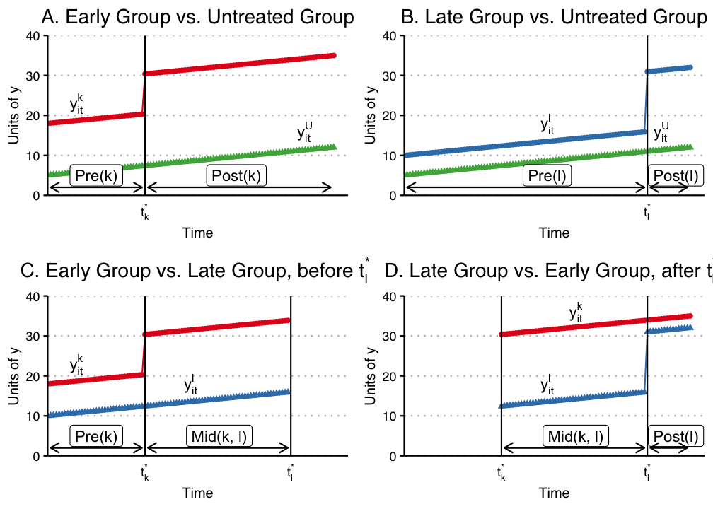

# Difference-in-Differences

```{r}
#| include: false
library(tidyverse)
library(did)
library(broom)
library(etwfe)
library(haven)
library(synthdid)
library(fixest)
library(ggplot2)
```

When unconfoundedness fails, we need weaker assumptions. The parallel trends assumption leads to the difference-in-differences estimator.

> **Related reading**: For a side-by-side comparison of DiD, synthetic DiD,
> synthetic control, and TASC on a *single* panel — the Proposition 99
> California smoking data, where the four estimators do not agree — see the
> [Same data, different estimators](https://xiangao.github.io/blog_book/tasc-time-aware-synthetic-control.html)
> chapter in *Topics on Econometrics and Causal Inference*.

## $T=2$ Panel Data

Suppose we have two periods, $t = (1,2)$. Some units are treated just prior to period 2. For each individual $i$, there are four potential outcomes:

$$ [Y_{i1}(0), Y_{i1}(1), Y_{i2}(0), Y_{i2}(1)] $$ {#eq-did-1}

Let $D$ denote the treated group. The ATT in period 2 is

$$ \tau_{2,att} = E(Y_2(1) - Y_2(0) | D=1) $$ {#eq-did-2}

The first term is observed. The second is the counterfactual.

## Parallel Trends Assumption

$$ E[Y_2(0) -Y_1(0) | D=1] = E[Y_2(0) - Y_1(0) | D =0] $$ {#eq-did-3}

or

$$ E[\Delta Y(0) | D=1] = E[\Delta Y(0) | D =0] $$ {#eq-did-4}

In words, the change in untreated potential outcomes between periods 1 and 2 is the same for treated and control groups.

## No Anticipation Assumption

$$ E[Y_1(1) - Y_1(0) | D=1] = 0 $$ {#eq-did-5}

This is to say, in period 1, there is no treatment effect for the treated group.

## DiD is Identified with PT and NA

With Parallel Trends, we notice $$\small  E[Y_2(0) | D=1 ]= E[Y_1(0) | D=1] + E[Y_2(0) - Y_1(0) | D=0] $$ {#eq-did-6}

Then, with No Anticipation, $$
\begin{aligned}
E[Y_2(0) | D=1 ] &= E[Y_1(1) | D=1] + E[Y_2(0) - Y_1(0) | D=0]\\
&= E[Y_1 | D=1] + E[Y_2-Y_1 | D=0]
\end{aligned}
$$ {#eq-did-7} 

$$\small  \tau_{2,att} = E[Y_2 - Y_1 | D=1] - E[Y_2-Y_1 | D=0] $$ {#eq-did-8}

## Advantages and Disadvantages of DiD

Advantages:

-   No need to assume unconfoundedness. We "only" need PT and NA. Or say we don't need treatment itself to be independent of potential outcomes, but we do need it to be independent to the change in potential outcome at least for untreated state. This is importantly weaker in a lot of situations. There can be selection bias. If the selection bias does not change over time, then DiD can handle it.

Disadvantages:

-   PT and NA might be violated.
-   PT is not scale free, in the sense that even if outcome can have PT, but then non-linear transformation of outcome won't have PT (for example log of Y).

## Traditional DiD

In practice, DiD in many period setting is usually done with

$$ Y_{it} = \alpha_i + \phi_t + W_{it} \beta + \epsilon_{it} $$ {#eq-did-9}

here $W_{it} =(1[t=2] \cdot D_i)$, which is the interaction of post-treatment indicator and treatment group indicator.

This is usually called Two Way Fixed Effect (TWFE). There are multiple ways to implement the same model in practice.

TWFE can be done by "Pooled OLS". That is, using OLS on time dummies and firm (individual) dummies. Wooldridge (2021) shows it's equivalent to use treatment dummies, instead of individual dummies. He also shows that this model can be equivalently implemented with fixed effect model and random effect model.

## TWFE with Staggered Treatment Timing

The problem comes in when there is different timing of treatment. People used to still use

$$ Y_{it} = \alpha_i + \phi_t + W_{it} \beta + \epsilon_{it} $$ {#eq-did-10}

where $W_{it}$ now is a dummy when an individual $i$ gets treated at time $t$.

However, what is $\beta$ here?

## Goodman-Bacon Decomposition

Goodman-Bacon (2021) showed that $\beta$ in the TWFE is a weighted average of many different treatment effects, between treated cohorts, and control units, both can be different at different time points. The weights are a function of the size of the subsample, relative size of treatment and control units, and the timing of treatment in the sub sample. The decomposition weights themselves are non-negative and sum to one; the problem is that the units treated earlier are used as controls later. When those "forbidden" 2x2 comparisons are expressed in terms of the underlying cohort-time ATTs, some ATTs receive negative weight (de Chaisemartin and D'Haultfœuille 2020). Therefore there is no meaningful interpretation of $\beta$: it does not need to be a convex combination of treatment effects.




## Wooldridge's ETWFE

There are a lot of ways to deal with staggered DiD situation. Wooldridge (2021) is basically saying: This is not a problem of TWFE, it's a mis-use of TWFE. The reason we get non-sensible result of $\beta$ is that we know there is heterogeneous treatment effect, in the sense the treatment effect differs across cohort, but we force them to be the same. If we relax it, it can work. As he shows, this works when we specify cohort effects accordingly.

$$ y_{it} = \alpha_i + \phi_t + \sum_{g=g_0}^G \sum_{t=g}^T \lambda_{g,t} \times 1(g,t) + \epsilon_{i,t} $$ {#eq-did-11}

Here $g$ is a cohort indicator, a cohort is determined by the time of getting treatment. ETWFE is allowing each cohort to have different effect at each different time point after being treated. The baseline group is the never treated group. If there is no never treated group, it can easily be changed to comparing to the last treated group.

## Example 1: US Teen Employment

We'll use the mpdta dataset on US teen employment from the did package. "Treatment" in this dataset refers to an increase in the minimum wage rate. Our goal is to estimate the effect of this minimum wage treatment (treat) on the log of teen employment (lemp). Notice that the panel ID is at the county level (countyreal), but treatment was staggered across cohorts (first.treat) so that a group of counties were treated at the same time. In addition to these staggered treatment effects, we also observe log population (lpop) as a potential control variable.

```{r did1, warning=FALSE, cache=TRUE, message=FALSE, echo=TRUE}
data("mpdta", package = "did")
head(mpdta)
```

The three tables below give the panel shape: observations per year, the
ever-treated indicator, and the treatment cohorts.

```{r did2, warning=FALSE, cache=TRUE, message=FALSE, echo=TRUE}
table(mpdta$year)
table(mpdta$treat)
table(mpdta$first.treat)
```

The panel is balanced: 500 counties observed in each of 2003 through 2007,
2,500 observations. 955 observations belong to ever-treated counties and 1,545
to never-treated ones. The cohorts are 2004 (100 observations, so 20 counties),
2006 (200, or 40 counties) and 2007 (655, or 131 counties), with 309 counties
never treated. Treatment timing is staggered, which is exactly the case where
plain TWFE misbehaves.

We fit ETWFE with log population as a control, clustering on county.

```{r did3, warning=FALSE, cache=TRUE, message=FALSE, echo=TRUE}
library(etwfe)

mod =
  etwfe(
    fml  = lemp ~ lpop, # outcome ~ controls
    tvar = year,        # time variable
    gvar = first.treat, # group variable
    data = mpdta,       # dataset
    vcov = ~countyreal  # vcov adjustment (here: clustered)
    )
```

```{r did4, warning=FALSE, cache=TRUE, message=FALSE, echo=TRUE}
mod
```

The raw model has one coefficient per cohort-year cell plus the control
interactions, 22 in all, and ten more were dropped for collinearity. That is not
something to read directly. `emfx()` aggregates the cells into the ATT.

```{r did5, warning=FALSE, cache=TRUE, message=FALSE, echo=TRUE}
emfx(mod)
```

The ATT is $-0.0506$ with a standard error of 0.0125 and a 95% interval of
$[-0.0751, -0.0261]$. Raising the minimum wage lowered teen employment by about
5% on average across treated county-years.

The same cells can be aggregated by time since treatment instead.

```{r did6, warning=FALSE, cache=TRUE, message=FALSE, echo=TRUE}
mod_es = emfx(mod, type = "event")
mod_es
```

The effect grows with exposure: $-0.033$ in the treatment year, $-0.057$ after
one year, $-0.138$ after two, $-0.110$ after three. All four are significant.
The standard errors widen with event time, from 0.013 to 0.032, because the
later horizons rest on fewer cohorts: event time 0 uses all three cohorts (191
counties), event time 1 uses the 2004 and 2006 cohorts (60 counties), and event
times 2 and 3 rest on the 2004 cohort alone (20 counties).

Adding `post_only = FALSE` keeps the pre-treatment periods in the plot.

```{r did7, warning=FALSE, cache=TRUE, message=FALSE, echo=TRUE}
mod_es2 = emfx(mod, type = "event", post_only = FALSE)

ggplot(mod_es2, aes(x = event, y = estimate, ymin = conf.low, ymax = conf.high)) +
  geom_hline(yintercept = 0) +
  geom_vline(xintercept = -1, lty = 2) +
  geom_pointrange(col = "darkcyan") +
  labs(
    x = "Years post treatment", y = "Effect on log teen employment",
    caption = "Note: Zero pre-treatment effects for illustrative purposes only."
  )
```

Read the pre-treatment points with care, and note the caption on the figure.
With `etwfe`'s default comparison group the pre-treatment estimates are forced
to zero by construction, so their sitting on the line is arithmetic, not
evidence for parallel trends. The Poisson example below uses
`cgroup = "never"`, which frees them and makes the pre-period a real check.

## Example 2: Staggered DiD

To see whether ETWFE recovers what it should, we switch to simulated data where
the answer is recorded in the file.

`data/did_staggered_6.dta` is Wooldridge's simulated staggered panel: 500 units
observed annually from 2001 to 2006, 3,000 observations. Units are treated in
2004 (119 units), 2005 (83) or 2006 (36), and 262 are never treated. The
outcome is `y`, `x` is a covariate, `d4`, `d5` and `d6` are cohort dummies, and
`f04`, `f05`, `f06` are year dummies. What makes the file useful is `te4`,
`te5` and `te6`: the true unit-level treatment effect each unit would
experience under each cohort's treatment date. The effects are heterogeneous
across units and grow with time since treatment, which is precisely the
configuration that breaks plain TWFE.

```{r did8, warning=FALSE, cache=TRUE, message=FALSE, echo=TRUE}
# now we do staggered did.
library(haven)
did_data <- read_dta('data/did_staggered_6.dta') %>%
  mutate(first_treat = case_when(d4==1 ~ 2004,
                                  d5==1 ~ 2005,
                                  d6==1 ~ 2006,
                                  .default = 0))

head(did_data %>% select(id, year, y, x,d4, d5, d6, te4, te5, te6, first_treat ))
```

```{r did19, warning=FALSE, cache=TRUE, message=FALSE, echo=TRUE}
table(did_data$first_treat)
```

The counts are observations, six per unit: 1,572 never-treated, 714 in the 2004
cohort, 498 in 2005, 216 in 2006.

Because the true effects are in the data, we can compute the target before
estimating it. Grouping the true effects by cohort and year gives the true ATT
in each cohort-year cell.

```{r did9, warning=FALSE, cache=TRUE, message=FALSE, echo=TRUE}
did_data <- did_data %>%
  mutate(treated_cohort1 =    case_when(d4 & f04 ~ "d4f04",
                              d4 & f05 ~ "d4f05",
                              d4 & f06 ~ "d4f06"),
         treated_cohort2 = case_when (
                              d5 & f05 ~ "d5f05",
                              d5 & f06 ~ "d5f06"),
         treated_cohort3= case_when(
                              d6 & f06 ~ "d6f06"))

  did_data %>%
    group_by(treated_cohort1) %>%
    summarise(mean4=mean(te4))
```

```{r did10, warning=FALSE, cache=TRUE, message=FALSE, echo=TRUE}
  did_data %>%
    group_by(treated_cohort2) %>%
    summarise(mean5=mean(te5))
  did_data %>%
    group_by(treated_cohort3) %>%
    summarise(mean6=mean(te6))
```

So the true cohort-year ATTs are: the 2004 cohort gains 3.76, 4.02 and 4.58 in
2004, 2005 and 2006; the 2005 cohort gains 2.74 and 3.52 in 2005 and 2006; the
2006 cohort gains 1.85 in 2006. (The `NA` rows are the units outside that
cohort, which are not part of its ATT.) Effects grow with time since treatment
and shrink across later cohorts --- heterogeneity in both directions.

Averaging those cells over the 559 treated observations gives a true overall
ATT of **3.677**. That is the number ETWFE has to reproduce.

```{r did11, warning=FALSE, cache=TRUE, message=FALSE, echo=TRUE}
library(etwfe)

# this replicates Jeff's results with pooled ols or xtreg, with covariate x.
mod =
  etwfe(
    fml  = y ~ x, # outcome ~ controls
    tvar = year,        # time variable
    gvar = first_treat, # group variable
    data = did_data,       # dataset
    vcov = ~id
        )

mod
```

```{r did12, warning=FALSE, cache=TRUE, message=FALSE, echo=TRUE}
emfx(mod)
```

ETWFE gives 3.67 with a standard error of 0.172 and a 95% interval of
$[3.33, 4.01]$, against a true 3.677. It recovers the ATT to three decimals.

The same holds for the disaggregations. By time since treatment:

```{r did20, warning=FALSE, cache=TRUE, message=FALSE, echo=TRUE}
mod_es = emfx(mod, type = "event")
mod_es
```

Estimated 3.11, 4.02 and 4.21 at event times 0, 1 and 2, against true values of
3.11, 3.81 and 4.58. Every interval covers its truth, and the estimates
reproduce the growth in the effect with exposure.

And by calendar year:

```{r did21, warning=FALSE, cache=TRUE, message=FALSE, echo=TRUE}
mod_es2 = emfx(mod, type = "calendar")
mod_es2
```

Estimated 3.51, 3.73 and 3.70 in 2004, 2005 and 2006, against true values of
3.76, 3.49 and 3.80. Again all three intervals cover.

Note that the calendar profile is nearly flat while the event-time profile
rises. There is no contradiction: later calendar years mix an older cohort with
large accumulated effects and a newly treated cohort with small ones, and the
two movements offset. This is why the aggregation has to be chosen to match the
question being asked.

## Nonlinear ETWFE: Count and Binary Outcomes

> **Related reading**: The theory behind nonlinear ETWFE --- Wooldridge's
> conditional parallel-trends assumption on the linear index, the incidental
> parameters argument for cohort rather than unit intercepts, and the average
> partial effects that follow --- is developed at length in
> [Extended two-way fixed effects](https://xiangao.github.io/blog_book/extended-twfe.html)
> in *Topics on Econometrics and Causal Inference*, with
> [count data](https://xiangao.github.io/blog_book/count-data.html) and
> [Poisson with exposure](https://xiangao.github.io/blog_book/poisson-exposure.html)
> covering the count case in more detail.

ETWFE is not limited to linear (continuous) outcomes. When the dependent variable is a count or a binary indicator, linear TWFE can give nonsensical results — negative predicted probabilities, additive effects that ignore the bounded or non-negative nature of $Y$. The `etwfe` package supports nonlinear families via the `family` argument, which passes to `fixest::feglm()`.

The key identifying assumption shifts slightly. Instead of parallel trends on $E[Y_{it}(\infty)]$, we assume parallel trends on the **linear index** — that is, on $\log E[Y_{it}(\infty)]$ for Poisson, or on $\text{logit}\, E[Y_{it}(\infty)]$ for logit. This is Wooldridge's (2023) Conditional Parallel Trends assumption stated on $G^{-1}(E[Y])$. When the true treatment effect is multiplicative (e.g., a policy raises counts by 50% regardless of baseline), this assumption is more natural than additive PT on $Y$ itself.

One implementation detail matters: the nonlinear ETWFE specification uses **cohort fixed effects** (one intercept per treatment cohort) plus year fixed effects — not individual unit fixed effects. The `etwfe` package handles this automatically. In the linear case the two are numerically equivalent (Wooldridge 2021), but in nonlinear models unit fixed effects raise the incidental-parameters problem and make average partial effects uncomputable — the unit intercepts cannot be averaged out of the nonlinear link. Wooldridge (2023) instead uses cohort intercepts (a Mundlak device), which is what `etwfe` implements.

### Simulated example: staggered count data

We simulate $N = 400$ units over $T = 6$ periods, 2,400 observations. Units are
split into four groups of 100 by id: the first is treated from period 3, the
second from period 4, the third from period 5, and the fourth never. Each unit
draws a fixed effect $\alpha_i \sim N(0, 0.3^2)$. The log mean is
$\log \mu_{it} = 1 + 0.2t + \alpha_i + 0.4 D_{it}$, and the outcome is
$Y_{it} \sim \text{Poisson}(\mu_{it})$.

The treatment effect is multiplicative and homogeneous on the log scale: every
treated unit's expected count rises by a factor of $\exp(0.4)$, that is by
$\exp(0.4) - 1 = 0.492$, or 49%. Parallel trends holds on the log scale by
construction, and fails on the level scale, since a constant proportional
effect is a larger absolute effect for units with higher baselines.

On the count scale the ATT is not 0.492. It is
$E[\mu_{it}(0) \mid \text{treated}] \times (\exp(0.4)-1)$, and the mean
untreated count among treated observations is 7.649, so the true ATT is
$7.649 \times 0.4918 = 3.762$ counts.

The table below reports mean counts by cohort and treatment status.

```{r did_pois0, warning=FALSE, cache=TRUE, message=FALSE, echo=TRUE}
library(tidyverse)
library(etwfe)

set.seed(42)
N <- 400; Tmax <- 6

unit_fe_vals <- rnorm(N) * 0.3

df_count <- expand.grid(id = 1:N, year = 1:Tmax) %>%
  as_tibble() %>%
  arrange(id, year) %>%
  mutate(
    cohort_grp  = ((id - 1) %/% 100) + 1,
    first_treat = c(3, 4, 5, 0)[cohort_grp],   # 0 = never treated
    treated     = (first_treat > 0) & (year >= first_treat),
    unit_fe     = unit_fe_vals[id],
    log_mu      = 1 + 0.2 * year + unit_fe + 0.4 * treated,
    count       = rpois(n(), exp(log_mu))
  )

df_count %>%
  group_by(first_treat, treated) %>%
  summarise(mean_count = mean(count), .groups = "drop")
```

The never-treated group averages 6.15 counts. Treated cohorts average 3.72,
4.29 and 4.80 before treatment and 10.7, 11.5 and 13.2 after. The pre-treatment
means look low only because they are drawn from earlier periods, and the time
trend adds 0.2 to the log mean each period. This is exactly the comparison that
a raw before-after difference would get wrong.

### Poisson ETWFE

Pass `family = "poisson"` to `etwfe()`. Everything else — cohort dummies, `emfx()`, event study — works identically to the linear case. We use `cgroup = "never"` so that pre-treatment estimates are not mechanistically forced to zero.

```{r did_pois1, warning=FALSE, cache=TRUE, message=FALSE, echo=TRUE}
mod_pois <- etwfe(
  fml         = count ~ 1,
  tvar        = year,
  gvar        = first_treat,
  data        = df_count,
  family      = "poisson",
  cgroup      = "never",
  vcov        = ~id
)
```

```{r did_pois2, warning=FALSE, cache=TRUE, message=FALSE, echo=TRUE}
emfx(mod_pois)
```

The estimate is 3.99 counts with a standard error of 0.33 and a 95% interval of
$[3.34, 4.64]$, against the true 3.762 derived above. The interval covers it.

`emfx()` returns average marginal effects — the average difference $E[Y(1)] - E[Y(0)]$ in **count units** across treated observations. This is the ATT on the count scale. The underlying model imposes PT on the log scale, so each cohort-time treatment coefficient in the raw model can be exponentiated to get the incidence rate ratio for that cell (here they share a common value because the simulated effect is homogeneous).

### Event study

Because we passed `cgroup = "never"`, the pre-treatment estimates are free
parameters rather than zeros by construction, so the pre-period is an actual
test here. On the count scale the post-treatment effect should also grow with
event time even though the log-scale effect is constant, because the baseline
count grows with the time trend: the true values are 3.13, 3.82, 4.17 and 4.69
at event times 0 through 3.

```{r did_pois4, warning=FALSE, cache=TRUE, message=FALSE, echo=TRUE}
mod_pois_es <- emfx(mod_pois, type = "event", post_only = FALSE)

ggplot(mod_pois_es, aes(x = event, y = estimate, ymin = conf.low, ymax = conf.high)) +
  geom_hline(yintercept = 0) +
  geom_vline(xintercept = -1, lty = 2) +
  geom_pointrange(col = "darkcyan") +
  labs(
    x = "Years post treatment",
    y = "ATT (count units)",
    title = "Nonlinear ETWFE event study (Poisson)"
  )
```

Pre-treatment estimates are close to zero, confirming parallel trends on the log scale holds in the simulation. The post-treatment points rise with event time, which is the count-scale consequence of a constant log-scale effect applied to a growing baseline, not evidence of a growing treatment effect.

### Comparison: linear ETWFE on log(count + 1)

A common alternative is to log-transform the count and run linear ETWFE. This is biased when zeros are present (the $+1$ shift distorts the linear index) and misinterprets the scale of the effect. For comparison:

```{r did_pois5, warning=FALSE, cache=TRUE, message=FALSE, echo=TRUE}
df_count <- df_count %>% mutate(log_count = log(count + 1))

mod_lin <- etwfe(
  fml  = log_count ~ 1,
  tvar = year,
  gvar = first_treat,
  data = df_count,
  vcov = ~id
)
emfx(mod_lin)
```

The linear model returns 0.38 with a 95% interval of $[0.318, 0.443]$. That
number is neither the count-scale ATT of 3.99 nor the log-scale parameter 0.4,
though it happens to sit near the latter because the counts here are large
enough that $\log(Y+1) \approx \log Y$. With many zeros the approximation
breaks and the estimate drifts.

The linear model estimates the ATT on the $\log(Y+1)$ scale — not the same quantity as the Poisson ATT and harder to interpret. When treatment effects are multiplicative, Poisson ETWFE is the more appropriate model.

## Spatial Interference

Everything in this chapter so far assumes SUTVA: one unit's outcome does not depend on another unit's treatment. That is not always plausible. A treated municipality may affect deforestation in nearby untreated municipalities. A vaccinated household may reduce transmission to nearby households. A labor-market policy in one commuting zone may change flows to its neighbors. With this kind of spatial spillover, the usual DiD estimand no longer has the interpretation we want. Xu [-@xu2023] shows that ignoring interference can produce an estimand that is neither a direct effect nor a spillover effect.

Xu [-@xu2023; -@xu2026] develops a doubly robust DiD that keeps the identifying logic of conditional parallel trends but adds an exposure mapping $G_{it} = G(i, W_{-it})$ for unit $i$'s neighborhood treatment status. The estimand is the direct ATT at exposure level $g$,

$$ \tau_g(t, c) = \frac{1}{|S_M|} \sum_{i \in S_M} \mathbb{E}[y_{it}(c, g) - y_{it}(\infty, g) \mid z_i, C_i = c, G_{it} = g], $$ {#eq-did-12}

where $C_i$ is unit $i$'s first treatment period (so $\{C_i > t\}$ is the not-yet-directly-treated comparison group), $S_M = \{C_i = c\} \cup \{C_i > t\}$, and $g$ is a chosen exposure level. The DR plug-in averages three pieces over $S_M$: an IPW term from the treated cohort, an IPW term from the not-yet-treated, and a regression-imputation term, with three propensity models ($\eta_{tc}$ for cohort, $\eta_{tcg}$ and $\eta_{t\infty g}$ for exposure) and two outcome-change regressions. It is consistent if either all three propensities or both outcome models are correctly specified.

The companion package [`didint`](https://github.com/xiangao/didint) implements this. The 2x2 base case (Xu 2023):

```{r did_int_2x2_demo, eval = FALSE}
library(didint)

# Wide-format two-period data with a binary exposure G.
res <- did_int_2x2(
  data       = panel,
  yname      = "Y_post",
  yname_pre  = "Y_pre",
  treat      = "W",
  exposure   = "G",
  g          = 1,
  covariates = c("z1", "z2"),
  trim       = 0.01     # Xu (2026) uses 0.01 in the Brazil application
)
print(res)
```

For staggered adoption (Xu 2026), `did_int_staggered()` loops over `(cohort, time)` cells with $t \geq c$, restricts to $S_M$ in each cell, fits the DR estimator, and aggregates across cells using joint-IF stacking (per-cell IFs share the never-treated comparison group, so independence-style SEs underestimate uncertainty noticeably). The `vignettes/brazil_amazon.Rmd` vignette of `didint` replicates Section III of Xu (2026), the *Lista de Municípios Prioritários* policy on Amazon deforestation, using the public Assunção-McMillan-Murphy-Souza-Rodrigues replication archive on Zenodo.

A Julia port with identical estimators is available as [`DidInterference.jl`](https://github.com/xiangao/DidInterference.jl).

## Persistent Outcomes and Heterogeneous Dynamics

Standard event-study TWFE regressions like

$$ Y_{it} = \alpha_i + \gamma_t + \sum_{j} D_{it}^j \delta_j + X_{it}'\beta + U_{it} $$ {#eq-did-13}

leave the dynamics of $Y$ unmodelled. Three things get run together here and
are worth separating.

The first is serial correlation in $U_{it}$. That is an inference problem rather
than an identification one: with exogenous treatment timing the event-time
coefficients remain consistent, but conventional standard errors are wrong,
which is why DiD is routinely clustered by unit.

The second is dynamic selection. If units are treated *because* of their recent
outcomes, then treatment timing is related to lagged $Y$ and the parallel-trends
restriction the specification relies on no longer holds. That is an
identification failure, and no amount of clustering repairs it.

The third is what motivates the rest of this section. When the outcome is
genuinely persistent — earnings, employment, consumption, anything with habits
or adjustment costs — the *structural* process carries its own lag, and
@eq-did-13 is a static equation fitted to dynamic data. The event-time dummies
then absorb the propagation of earlier shocks along with the treatment response,
and the bias on those coefficients grows with the event-time horizon (Botosaru
and Liu, 2025, Figure 1). Note where the bias comes from: not from persistence
in the residual, which on its own does no such thing, but from fitting a static
specification to a dynamic process.

Botosaru and Liu [-@botosaru-liu-2025] introduce a **dynamic panel
with correlated random coefficients** that handles both persistence
and unit-level heterogeneity in dynamic responses:

$$ Y_{it} = \rho_Y Y_{i,t-1} + \alpha_i + \sum_j D_{it}^j \delta_{ij} + X_{it}'\beta + U_{it}, $$ {#eq-did-14}

with a parsimonious AR(1) structure on the event-time effects to keep
dimensionality manageable:

$$ \delta_{ij} = \rho_\delta \delta_{i,j-1} + \varepsilon_{ij}, \quad j \geq 1. $$ {#eq-did-15}

The latent $\lambda_i = (\alpha_i, \delta_{i0})$ is a unit-specific
correlated random coefficient. A two-step semiparametric estimator: step 1
is **quasi-maximum likelihood** for the common parameters
$(\rho_Y, \rho_\delta, \sigma_U^2, \sigma_\varepsilon^2, \beta)$ under
a Gaussian working assumption on $\lambda_i$ (consistent under
misspecification of that working assumption); step 2 is
**Tweedie / Gaussian-conjugate empirical Bayes** for the unit-level
posterior trajectories $\{\delta_{i,j}\}_{j=0}^J$, achieving asymptotic
ratio optimality.

A companion paper [@botosaru-liu-2026] adds a **homogeneous-feedback
extension**: covariates $X_{it}$ are allowed to adjust endogenously to
past $Y$ and treatment (the canonical example: minimum-wage policy
affects wages directly and also indirectly through firms re-optimising
input demand). Under the assumption that the covariate adjustment rule
does not depend on $\lambda_i$ given the observable history, the
likelihood factors into a structural piece (for $Y \mid X$, history)
and a feedback piece (for $X$ given history), each separately
identified. The factorisation yields a clean decomposition of dynamic
treatment effects into **direct** (through $\delta_{i,j}$) and
**indirect** (through covariate feedback) components.

The package [`tvhte`](https://github.com/xiangao/tvhte) implements
both papers:

```{r tvhte_demo, eval = FALSE}
library(tvhte)

# Fit on a panel with staggered cohorts and a covariate
fit <- tvhte(Y = panel_Y, Y0 = baseline_Y, t0 = cohort,
             J = max_event_time, X = panel_X)
print(fit)

# Feedback model + direct/indirect counterfactual decomposition
fb <- fit_feedback(panel_Y, baseline_Y, panel_X, baseline_X)
cf <- simulate_counterfactual(fit, fb, t0_star = alt_cohort)
```

A Julia port with the same API is at
[`TVHTE.jl`](https://github.com/xiangao/TVHTE.jl); both packages have
deployed docs at <https://xiangao.github.io/tvhte/> and
<https://xiangao.github.io/TVHTE.jl/>.

## Synthetic Control

The biggest problem with DiD is the PT assumption. There is not really a test for it, just like the unconfoundedness assumption. It is less demanding than unconfoundedness assumption, but nevertheless hard to justify sometimes.

Abadie (2010)'s idea is to construct a control unit, out of many control units (donor pool), which is a weighted average of all donor units, that then hopefully is very close to the treated unit in terms of outcome, in the pre-treatment periods. This works pretty well in practice, when you have a somewhat large donor pool. Of course there is still no test for post-treatment period, but for pre-treatment periods, usually it can get almost identical trend as the treated unit. This was designed for single treated unit at the beginning, but got extended to multiple treated units later on.

## Synthetic DiD

Arkhangelsky et al (2021) tries to combine the idea of DiD and SC. SC assigns different weights to different control units. The standard DiD is a TWFE, assigning equal weights to all time periods and units.

To see that, DiD objective function:

$$ \small (\hat \tau^{did}, \hat \mu, \hat \alpha, \hat \beta) = \underset{\tau, \mu, \alpha, \beta}{argmin} { \Sigma_{i=1}^N \Sigma_{t=1}^T (Y_{it} - \mu - \alpha_i - \beta_t - W_{it} \tau)^2}$$ {#eq-did-16}

SC objective function: $$ (\hat \tau^{sc}, \hat \mu, \hat \beta) = \underset{\tau, \mu, \beta}{argmin} { \Sigma_{i=1}^N \Sigma_{t=1}^T \hat \omega_i^{sc} (Y_{it} - \mu - \beta_t - W_{it} \tau)^2}$$ {#eq-did-17}

It's a unit-weighted regression with time effects. The weights are set to optimally match donor units to treated unit so that they are as close as possible, in each time point. Note there is no $\alpha_i$, since it's forced to be 0 — so SC is not simply DiD with weights: it also drops the unit fixed effects. The clean nesting is through SDiD below: DiD is SDiD with all unit and time weights set to 1, and SC is SDiD with the $\alpha_i$ removed and time weights set to 1.

SDiD:

$$ \small (\hat \tau^{sdid}, \hat \mu, \hat \alpha, \hat \beta) = \underset{\tau, \mu, \alpha, \beta}{argmin} { \Sigma_{i=1}^N \Sigma_{t=1}^T \hat \omega_i^{sdid} \hat \lambda_t^{sdid} (Y_{it} - \mu - \alpha_i - \beta_t - W_{it} \tau)^2}$$ {#eq-did-18}

SDiD sets another weight in addition to SC weights, which changes over time. The SC weights are trying to construct a control unit that is close to the treated unit; the SDiD weights are trying to put more weights on pre-treatment periods that are more similar to post-treatment periods.

### Example: California Proposition 99

The `california_prop99` panel is annual per-capita cigarette sales in packs for
39 US states from 1970 to 2000. California raised its cigarette tax in 1989, so
there is one treated unit, 38 controls, 19 pre-treatment years and 12
post-treatment years. The estimand is the effect of Proposition 99 on
California's cigarette consumption.

```{r did13, warning=FALSE, cache=TRUE, message=FALSE, echo=TRUE}
library(synthdid)
data('california_prop99')
setup = panel.matrices(california_prop99)
tau.hat = synthdid_estimate(setup$Y, setup$N0, setup$T0)
```

```{r did14, warning=FALSE, cache=TRUE, message=FALSE, echo=TRUE}
summary(tau.hat)
```

The point estimate, $-15.6$, is the headline number from Arkhangelsky et al.
(2021). Note that the `se` entry comes back `NA`, and that is not a glitch to
skim past: `summary()` defaults to a **jackknife** standard error, which deletes
one treated unit at a time. California is the *only* treated unit here, so
deleting it leaves nothing to estimate and the jackknife is undefined. The
bootstrap SE fails for the same reason. With a single treated unit the usable
option is the placebo method, which builds the reference distribution by
pretending each control state was treated:

```{r did14b, warning=FALSE, cache=TRUE, message=FALSE, echo=TRUE}
set.seed(12345)
cat(sprintf("N0 = %d control states, T0 = %d pre-periods, N1 = %d treated unit\n",
            setup$N0, setup$T0, nrow(setup$Y) - setup$N0))

se_placebo <- as.numeric(synthdid_se(tau.hat, method = "placebo"))
cat(sprintf("SDiD estimate %.2f, placebo SE %.2f, 95%% CI [%.2f, %.2f]\n",
            as.numeric(tau.hat), se_placebo,
            as.numeric(tau.hat) - 1.96 * se_placebo,
            as.numeric(tau.hat) + 1.96 * se_placebo))
```

Two cautions on that interval. The placebo standard error is a permutation
quantity, so it moves with the seed --- report the seed, or average over several.
And it is justified under the assumption that the treated unit is exchangeable
with the controls, which is a real assumption about California, not a technicality.
The interval here comfortably includes zero, which is worth stating plainly: the
much-cited $-15.6$ is not statistically distinguishable from no effect with 38
control states and one treated unit. Note also that `summary(tau.hat,
se.method = "placebo")` does *not* fix the `NA` --- the `se` field stays empty;
`synthdid_se()` has to be called directly.

The summary output is also worth reading past the point estimate. The unit
weights are concentrated: Nevada takes 0.124, New Hampshire 0.105, Connecticut
0.078, and the effective number of controls is 16.4 out of 38. The time weights
put 0.427 on 1988, 0.366 on 1986 and 0.206 on 1987, giving an effective 2.8
pre-periods out of 19. Both are the point of the method --- weight the donors
and the pre-periods that resemble the target --- and both are the reason the
inference is hard.

Running the same panel through all three estimators shows what the weighting
does:

```{r did15, warning=FALSE, cache=TRUE, message=FALSE, echo=TRUE}
tau.sc   = sc_estimate(setup$Y, setup$N0, setup$T0)
tau.did  = did_estimate(setup$Y, setup$N0, setup$T0)
estimates = list(tau.did, tau.sc, tau.hat)
names(estimates) = c('Diff-in-Diff', 'Synthetic Control', 'Synthetic Diff-in-Diff')
print(unlist(estimates))
```

Plain DiD gives $-27.35$, synthetic control $-19.62$, and synthetic DiD
$-15.60$. The three differ by more than the placebo standard error of 8.37, so
the choice of estimator matters more here than the sampling uncertainty within
any one of them. DiD weights every control state and every pre-period equally,
which is why it moves furthest: states unlike California, and pre-periods unlike
the late 1980s, all count in full.

```{r did16, warning=FALSE, cache=TRUE, message=FALSE, echo=TRUE}
plot <- synthdid_plot(estimates, facet.vertical=FALSE,
              control.name='control', treated.name='california',
              lambda.comparable=TRUE, se.method = 'none',
              trajectory.linetype = 1, line.width=.75, effect.curvature=-.4,
              trajectory.alpha=.7, effect.alpha=.7,
              diagram.alpha=1, onset.alpha=.7) +
    theme(legend.position=c(.26,.07), legend.direction='horizontal',
          legend.key=element_blank(), legend.background=element_blank(),
          strip.background=element_blank(), strip.text.x = element_blank())
```

```{r did17, warning=FALSE, cache=TRUE, message=FALSE, echo=TRUE}
plot
```

Each panel shows California's trajectory against the weighted control
trajectory, with the estimated effect drawn as the gap after 1989. The time
weights $\lambda_t$ are plotted along the bottom, so the pre-periods that
actually enter the comparison are visible: for synthetic DiD they concentrate on
1986 to 1988, the years just before the tax change. The synthetic control and
synthetic DiD panels track California closely before 1989; the DiD panel does
not, which is the visual counterpart to its larger estimate.
